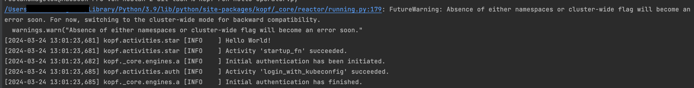

# sit-task

sit-task is a simple repository that is part of the application process at [Schwarz Dienstleistung](https://jobs.schwarz/) for the job as a [DevOps Engineer - Kubernetes](https://schwarz.jobs.schwarz/job/Neckarsulm-%28hybrid%29-DevOps-Engineer-Kubernetes-%28mwd%29/1018667401/)

The repository is setup to:
1. document the approach and thinking process
2. store the code and make it available for evaluation

## The task

The task consists of two main points:
- *Setup a local cluster and create a [Kopf](https://kopf.readthedocs.io/) operator that executes a handler on a "kopf.on.startup" event and writes "Hello World!" to standard output*
- *Commit the code to a public repo, e.g. Github*

## Steps to complete the task

- Familiarize with the Kopf framework by reading the provided documentation
- Install the required software
    - [Python >= 3.8](https://www.python.org/)
    - [kubectl](https://kubernetes.io/docs/tasks/tools/)
    - [minikube](https://minikube.sigs.k8s.io/docs/)
    - [Kopf](https://kopf.readthedocs.io/en/stable/)
- Start the local Kubernetes cluster with "minikube start" command in a Terminal
- Create a new GitHub Repository with a Readme File
- Clone the GitHub Repository using PyCharm CE
- Create a new operator by creating the file "hello-operator.py"
- Follow the guide on [Startup](https://kopf.readthedocs.io/en/stable/startup/) from Kopf docs
- Test the operator by running "kopf run hello-operator.py" from root project directory
- Verify the output 

- Fill the README and add all new files to git
- Commit and push the code to GitHub

## Encountered problems

- "kopf" command was not working at first
    - Solution was to add the kopf binary to PATH environment variable
    - Achieved this by adding a new line to .zshrc file:
        - export PATH="/Users/username /Library/Python/3.9/bin:$PATH"
- running "kopf run hello-operator.py" worked but gave a FutureWarning:

    - After searching for the error, found the page on [Scopes](https://kopf.readthedocs.io/en/stable/scopes/) from Kopf doc
    - Running "kopf run -A hello-operator.py" got rid of the warning (see Screenshot above)
